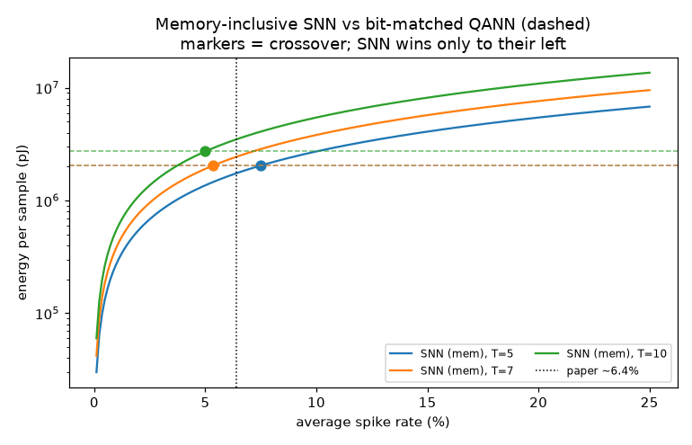

# Honest energy accounting for SNNs: three numbers side by side

## Title

Honest energy accounting — reporting the SOP proxy, memory-inclusive SNN energy,
and the bit-matched quantized-ANN baseline together, so an SNN efficiency claim
carries its own crossover.

## Paper & arXiv/DOI

- **Title:** *Reconsidering the energy efficiency of spiking neural networks*
  (the hardware-aware, memory-inclusive accounting and the bit-matched QNN
  baseline). Compute constants from Horowitz, *Computing's Energy Problem (and
  what we can do about it)*, ISSCC 2014.
- **Authors / venue / year:** Zhanglu Yan, Zhenyu Bai, Weng-Fai Wong,
  arXiv:2409.08290, 2024. Horowitz, ISSCC 2014.
- **Link:** https://arxiv.org/abs/2409.08290
- **Bucket:** new (novelty — an analytic tooling/measurement study, not a new
  model). PROGRAM.md flagship **F4**.

## Claim under test

The standard SNN energy proxy — `E_AC × (spike_rate × fanout × T)` — counts
arithmetic only and **wildly under-reports** true energy because it ignores
memory traffic. When you add weight-memory and membrane-state access (per
arXiv:2409.08290) and compare against a **bit-matched** `⌈log₂(T+1)⌉`-bit
quantized ANN of the same architecture, an SNN beats the QANN only below an
average spike rate of **~6.4%** for `T ∈ [5,10]`. We reproduce that crossover
analytically and check where a real trained spiking classifier lands relative to
it.

## Method

`honest_energy.py` is an **analytic** estimator. For a reference architecture
(`Linear(256,128) → LIF(128) → Linear(128,10) → LI(10)`; 34,048 synapses, 138
state neurons) it computes three energies per input sample, all in pJ from
published constants:

1. **SOP proxy (arm 1)** — `E_AC(w) × SOPs`, `SOPs = T·(s·W₁ + s_hid·W₂)`.
   Compute only. `E_AC` scaled from Horowitz's 32-bit FP add (0.9 pJ).
2. **Memory-inclusive SNN (arm 2)** — arm-1 arithmetic (accumulate + per-step
   threshold + reset) **plus** a weight fetch per accumulate (DRAM, 20 pJ/bit ≈
   1300 pJ / 64-bit word) **plus** membrane read+write every timestep for every
   state neuron (on-chip, 0.25 pJ/bit). Yan et al.'s `E_ACC = 0.05448 pJ` etc.
3. **Bit-matched QANN (arm 3)** — one dense forward pass at `b = ⌈log₂(T+1)⌉`
   bits: dense MACs + one weight fetch per MAC + activation movement.

Because arm 2 is exactly affine in the spike rate, the **crossover** `s*` where
`E_SNN = E_QANN` is solved in closed form. We then **train** the actual spyx
classifier (surrogate-gradient, synthetic Bernoulli spiking task, no dataset) at
several input-drive levels and one `spyx.fn.sparsity_reg` setting, **measure** the
input and hidden spike rates, and cost those real operating points with the same
estimator.

**Precision assumption (documented):** SNN weights/state at 8 bits (a typical
post-QAT SNN); QANN bit-matched at `⌈log₂(T+1)⌉` (3–4 bits for `T ∈ [5,10]`).
This asymmetry is what sets the ~6% crossover — `s* ≈ b / (8·T)`. Sensitivity: if
the SNN were bit-matched too, `s* → ~1/T` (10–20%); if it paid Loihi sparse-route
cost (3.0 pJ/bit) for weight fetch, `s* → ~1–2%`.

## Spyx modules used

- [`spyx.nn.LIF`](../../../src/spyx/nn.py), [`spyx.nn.LI`](../../../src/spyx/nn.py),
  [`spyx.nn.Sequential`](../../../src/spyx/nn.py),
  [`spyx.nn.run`](../../../src/spyx/nn.py)
- [`spyx.axn.superspike`](../../../src/spyx/axn.py)
- [`spyx.fn.integral_crossentropy`](../../../src/spyx/fn.py),
  [`spyx.fn.integral_accuracy`](../../../src/spyx/fn.py),
  [`spyx.fn.sparsity_reg`](../../../src/spyx/fn.py) (the spike-rate knob)

## How to run

```bash
SPYX_SMOKE=1 uv run python research/new/honest_energy_accounting/honest_energy.py  # fast
uv run python research/new/honest_energy_accounting/honest_energy.py               # full
```

CPU-only (energy is estimated, not measured). Full run ≈ 14 s. Writes
`honest_energy_results.json` (with the exact pJ constants + citations) and
`honest_energy_crossover.png`. No dataset download.

## Results

**Analytic crossover — SNN(mem-inclusive) == bit-matched QANN:**

| T | QANN bits | crossover s\* |
| --- | --- | --- |
| 5 | 3 | 7.50% |
| 6 | 3 | 6.25% |
| 7 | 3 | 5.36% |
| 8 | 4 | 6.25% |
| 9 | 4 | 5.56% |
| 10 | 4 | 5.00% |
| **mean [5,10]** | | **5.99%** |

Paper threshold ≈ 6.4%; measured mean = **5.99%** (within 0.4 pp). ✅

**Three-number energy (pJ per sample), selected rows:**

| T | s | SOP proxy (arm 1) | SNN mem-incl (arm 2) | QANN (arm 3) | SNN/QANN | proxy under-reports |
| --- | --- | --- | --- | --- | --- | --- |
| 7 | 0.020 | 1.07e3 | 7.67e5 | 2.05e6 | 0.37 | 715× |
| 7 | 0.050 | 2.68e3 | 1.91e6 | 2.05e6 | 0.93 | 713× |
| 7 | 0.064 | 3.43e3 | 2.45e6 | 2.05e6 | 1.19 | 712× |
| 7 | 0.100 | 5.36e3 | 3.82e6 | 2.05e6 | 1.87 | 712× |
| 10 | 0.050 | 3.83e3 | 2.73e6 | 2.73e6 | 1.00 | 713× |

The SOP proxy under-reports true SNN energy by **~700×** across the sweep — the
whole point.

**Trained classifier operating points (T=8, real measured spike rates):**

| setting | acc | input rate | hidden rate | SNN/QANN | wins? |
| --- | --- | --- | --- | --- | --- |
| sparse_input | 100% | 3.0% | 2.9% | 0.47 | **yes** |
| low_drive | 100% | 7.1% | 2.9% | 1.11 | no |
| mid_drive | 100% | 17.5% | 3.3% | 2.71 | no |
| regularised (`sparsity_reg`) | 100% | 39.4% | 2.2% | 6.08 | no |
| high_drive | 100% | 39.4% | 4.7% | 6.09 | no |

(Synthetic task is easy → 100% acc throughout; the point is the spike rates.)

## Findings

**Confirmed.** The analytic crossover averages **5.99%** over `T ∈ [5,10]`,
matching the paper's **~6.4%** threshold to within half a percentage point, and
falls exactly where `s* ≈ ⌈log₂(T+1)⌉ / (8·T)` predicts. Below it the
memory-inclusive SNN beats the bit-matched QANN; above it the QANN wins.

Three honest observations the three-number view forces into the open:

1. **The SOP proxy under-reports by ~700×.** At every point in the sweep the
   standard compute-only number is ~700× smaller than the memory-inclusive
   energy. Any efficiency claim quoting only arm 1 is off by nearly three orders
   of magnitude — memory movement, not arithmetic, dominates.

2. **Real trained SNNs mostly sit *above* the crossover — because of the input
   layer.** The `spyx.fn.sparsity_reg` arm drives the *hidden* rate down to 2.2%,
   but the *input* encoding stays dense (39%), and the 32,768-synapse input layer
   dominates the SOP count. Result: SNN/QANN = 6.08 — a loss. Only the
   `sparse_input` model, whose input itself is ~3%, actually beats the QANN
   (0.47×). Sparsifying the hidden layer alone does **not** buy the efficiency
   win; the input coding density does. This is the honest, less-comfortable
   corollary of the 6.4% result.

3. **The crossover is an assumption-laden model, not a law.** It is literature
   constants plus one modelling choice (8-bit SNN weights vs bit-matched QANN).
   The `sensitivity_note` in the JSON records how it moves (to ~1/T, or ~1–2%)
   under other defensible choices.

**Honesty:** every pJ constant is a published literature value (Horowitz 2014 for
45 nm compute; Yan et al. 2024 for 22 nm compute + memory). This is an **analytic
model, not a silicon measurement.** The value of the study is the *side-by-side
discipline*: no SNN efficiency number should be reported without its
memory-inclusive cost and its bit-matched-QANN ratio next to it.



## Reproducibility

- **Seeds:** `jax.random.PRNGKey` via `nnx.Rngs(seed)`, seeds `[0, 1]` (full),
  `[0]` (smoke); NumPy `default_rng(seed)` for the synthetic data.
- **JAX / hardware:** JAX on CPU (`backend=cpu`); energy is *estimated*, so the
  accelerator is irrelevant to the result. Reference machine: Radeon 8060S /
  gfx1151.
- **Constants:** recorded verbatim in `honest_energy_results.json`
  (`constants_pJ`, `citations`).
- **Spyx commit:** run on branch `feat/method-app-arch-org` (see `git rev-parse
  HEAD`).
- **Date run:** 2026-07-06.
